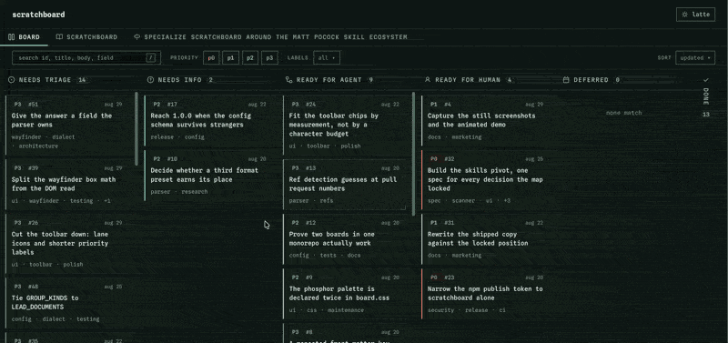

<div align="center">


<h1>scratchboard</h1>

<p><b>Your markdown tickets as a kanban board, for any git repository</b></p>

<p>Tickets are agent-driven, so the agent moves the card. Read-only by choice.</p>

<p>
  <a href="https://www.npmjs.com/package/scratchboard"></a>
  <a href="https://www.npmjs.com/package/scratchboard"></a>
  <a href="https://github.com/darecstowell/scratchboard/actions/workflows/test.yml"></a>
  <a href="./LICENSE"></a>
  
</p>

<p><code>npx scratchboard</code></p>



</div>

`npx scratchboard` reads the markdown tickets already in your repo, maps them to lanes, and
opens a board in your browser. One self-contained HTML file in your temp directory. No config,
no dependencies, nothing written back to your repo.

There is no drag and drop and no write-back. Tickets are agent-driven, so the agent moves the
card. This keeps your current flow safe.

```bash
npx scratchboard                            # the board
npx skills add darecstowell/scratchboard    # the skill, for the setup that needs judgment
```

Node 18 or later.

<!-- IMAGE SLOT 1: wide still of the board in the phosphor theme.
     File: assets/screenshot-phosphor.png
     Intended size: 1600x1000, rendered at full README width.
     Caption: The board in phosphor, reading this repo's own tickets. -->

<!-- IMAGE SLOT 2: wide still of the same board in the latte theme.
     File: assets/screenshot-latte.png
     Intended size: 1600x1000, rendered at full README width.
     Caption: The same board in latte. -->

**Live demo:** [darecstowell.github.io/scratchboard](https://darecstowell.github.io/scratchboard/)
is this repo's own backlog, baked by this repo's own scratchboard on every push to `main`.

## How it works

Run it in a repo with no config and it does three things.

1. **Finds your tickets.** It checks `.scratch/`, `.tickets/`, `docs/issues/`, `issues/`, and
   `tasks/`, then any other directory holding three or more markdown files it can read. YAML
   front matter and a plain `Key: value` block both need no setup.
2. **Maps them to lanes.** Folders first, so `todo/`, `in-progress/`, and `done/` become the
   lanes in that order. With no folders to go on it uses a status field. Any other metadata
   whose values repeat becomes a filter chip.
3. **Bakes one HTML file and opens it.** It lands in the OS temp directory, so nothing shows up
   in `git status`. That file travels too. Attach it to a pull request, or drop it in a chat.

Search, filters, and sort live in the URL hash, so a filtered board is a link you can send. Two
themes ship, `latte` and `phosphor`.

To keep the guess, the first run offers to save it and `scratchboard init` writes it any time.
Both write `scratchboard.json` at the repo root. Commit it and later runs skip detection.

### Live reload

`--serve` keeps the board open and reloads it when the files change. Leave it on a second
monitor while an agent works the tickets underneath you, and the cards move on their own.

```bash
npx scratchboard --serve
```

<!-- IMAGE SLOT 3: animated capture of a live reload.
     File: assets/live-reload.gif
     Intended size: 1200x750, under 8 MB so GitHub plays it inline.
     Caption: An agent edits a ticket. The card moves. Nothing is clicked. -->

## Configuration

Every key is optional, and anything you leave out comes from detection. A lane is a match rather
than a location, so a ticket never gets moved to join one.

```json
{
  "title": "Roadmap",
  "tickets": ".scratch/**/issue.md",
  "format": "yaml-frontmatter",
  "idPattern": "^(\\d+)-",
  "lanes": [
    { "name": "Todo",        "match": { "path": ".scratch/todo/**" } },
    { "name": "In progress", "match": { "path": ".scratch/in-progress/**" } },
    { "name": "Done",        "match": { "path": ".scratch/done/**" }, "collapsed": true }
  ],
  "facets": [
    { "field": "priority", "colors": { "p0": "red", "p1": "amber", "p2": "cyan", "p3": "neutral" } },
    { "field": "labels" }
  ]
}
```

Every key, every flag, the glob tokens, the lane and facet rules, and what detection does in
full: [`docs/reference.md`](./docs/reference.md).

## The skill

The CLI is the whole tool. The skill is for the part that needs judgment: looking at a repo full
of tickets and deciding what the lanes should be.

```bash
npx skills add darecstowell/scratchboard
```

It has three jobs, and none of them is narrating a command you could have run yourself.

1. Ask where the tickets live, and confirm the glob against real files.
2. Read the detection report and correct the lane mapping. Tickets sitting in the trailing
   `Unmapped` lane are the signal.
3. Write a parser when neither preset reads your format.

It writes only `scratchboard.json` and `scratchboard.parser.mjs`, it asks before each, and it
never touches a ticket. `SKILL.md` follows the [agentskills.io](https://agentskills.io) format,
so Claude Code, Codex CLI, Cursor, Windsurf, Copilot, Amp, and Gemini CLI all read it.

## Custom parsers

Neither preset reads your format? A module of about 30 lines covers it, and nothing else in the
config changes.

```js
// scratchboard.parser.mjs
export function parse(path, text) {
  return { id, title, body, fields };
}
```

The only boundary is one line: the body has to be markdown, because the board renders it. The
metadata format is fully open, and `fields` is untyped, so your own `severity` or `team` field
works with no code change. See the
[full contract](./docs/reference.md#custom-parsers), or let the skill write it.

## What it is not

Scratchboard is not a task manager. It does not create tickets, move them, or edit their front
matter. It owns no directory and no file format. It reads the layout your repo already has and
draws a board from it.

[Backlog.md](https://github.com/MrLesk/Backlog.md) leads this category and it earns the lead: a
CLI that creates and edits tasks, a web UI with drag and drop, a terminal board, MCP for agents,
and a `backlog/` folder it owns end to end. **If you want a task manager that owns your files,
use Backlog.md.** It will serve you better than this will.

Scratchboard is for the other case. Your tickets already exist, in a shape you picked, and you
want a window onto them.

- **No write-back, no drag and drop.** Tickets are agent-driven, so the agent moves the card.
- **One board per config.** A second board means a second config file, on purpose.
- **No single-file `TODO.md` format.** One ticket is one file. If you keep everything in one
  file, [md-kanban](https://www.npmjs.com/package/md-kanban) handles that shape.
- **No hosted service, no accounts, no telemetry.** The board is one HTML file in your temp
  directory. Nothing phones home.
- **Zero dependencies**, and that is a rule rather than a current state.

## Third-party

Two bundled fonts, and palettes derived from a third project. Each notice travels with the files
it covers, including the base64 bytes inlined into a baked board.

| What | Licence | Notice |
| --- | --- | --- |
| [Spline Sans Mono](https://github.com/SorkinType/SplineSansMono) | SIL Open Font License 1.1 | [`licenses/OFL-SplineSansMono.txt`](./licenses/OFL-SplineSansMono.txt) |
| [Martian Mono](https://github.com/evilmartians/mono) | SIL Open Font License 1.1 | [`licenses/OFL-MartianMono.txt`](./licenses/OFL-MartianMono.txt) |
| [Catppuccin](https://github.com/catppuccin/catppuccin) | MIT | [`licenses/Catppuccin-MIT.txt`](./licenses/Catppuccin-MIT.txt) |

The `latte` and `phosphor` themes are original palettes derived from Catppuccin rather than
copies of it.

## Where it came from

Scratchboard was the internal board on [OffMain](https://offmain.dev) and turned out to be
useful on its own. That repo's ticket tree is the corpus every change here is tested against.

## Licence

MIT. See [LICENSE](./LICENSE).
