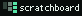

# Your markdown tickets as a kanban board. Read-only by choice.

[](https://www.npmjs.com/package/scratchboard)
[](https://github.com/darecstowell/scratchboard/actions/workflows/test.yml)
[](./LICENSE)

`npx scratchboard` reads the markdown tickets already in your repo, maps them to lanes, and
opens a board in your browser. Ten seconds, nothing installed, nothing written back.

There is no drag and drop and no write-back. Tickets are agent-driven, so the agent moves the
card. A mouse does not need to.

```bash
npx scratchboard
```

<!-- IMAGE SLOT 1: wide still of the board in the phosphor theme.
     File: assets/screenshot-phosphor.png
     Intended size: 1600x1000, rendered at full README width.
     Caption: The board in phosphor, reading this repo's own tickets. -->

<!-- IMAGE SLOT 2: wide still of the same board in the latte theme.
     File: assets/screenshot-latte.png
     Intended size: 1600x1000, rendered at full README width.
     Caption: The same board in latte. -->

**Live demo:** [darecstowell.github.io/scratchboard](https://darecstowell.github.io/scratchboard/)
is this repo's own backlog, baked by this repo's own scratchboard on every push. It goes live
after the first push to `main`.

## Where it came from

Scratchboard was pulled out of a working board. It was built for
[OffMain](https://offmain.dev) and reads its real ticket tree: 177 tickets across three
folders, nine status values against a canon of five, and 93 labels. That board is the
acceptance test.

## Install

Two paths out of one repo. Take the CLI on its own, or add the skill when you want an agent
to do the setup that needs judgment.

```bash
npx scratchboard                            # the tool, no agent needed
npx skills add darecstowell/scratchboard    # the skill, for the hard parts
```

Node 18 or later. Zero dependencies, and that is a rule rather than a current state.

Both paths track the same commit, so the parser never forks.

### Commands

```
scratchboard                      bake to temp, open, exit
scratchboard --serve              serve + watch + live reload
scratchboard --out <path>         write the baked HTML here instead of temp
scratchboard --config <path>      use this config, and its directory as the root
scratchboard --port <n>           serve mode, default 8787, walks up on conflict
scratchboard --no-open            do not launch a browser
scratchboard --scan               print the JSON payload to stdout, exit
scratchboard --help               print this
scratchboard --version            print the version
scratchboard init                 detect and write scratchboard.json
  --tickets <glob>                skip the ticket-path prompt
  --yes                           accept detection, never prompt
```

The default run bakes one self-contained HTML file into the OS temp directory and opens it.
Nothing lands in your repo, so nothing appears in `git status` and there is no `.gitignore`
conversation. That one file also travels: attach it to a pull request, or drop it in a chat.

## Configuration

Run it with no config first. Scratchboard detects the layout, works out the lanes, and opens
the board, so write a config only when the guess is wrong or when you want to keep it.

Detection looks for tickets in `.scratch/`, `.tickets/`, `docs/issues/`, `issues/`, and
`tasks/`, in that order, and falls back to any directory holding three or more markdown files
that parse. It then picks a preset, proposes lanes from the folders that hold tickets, and
keeps every metadata field whose values repeat as a filter facet.

When you want to keep the result, `scratchboard init` writes it to `scratchboard.json` at the
repo root. Commit that file.

```json
{
  "title": "OffMain",
  "tickets": ".scratch/**/issue.md",
  "format": "yaml-frontmatter",
  "idPattern": "^(\\d+)-",
  "lanes": [
    { "name": "Todo",        "match": { "path": ".scratch/todo/**" } },
    { "name": "In progress", "match": { "path": ".scratch/in-progress/**" } },
    { "name": "Done",        "match": { "path": ".scratch/done/**" }, "collapsed": true }
  ],
  "facets": [
    { "field": "priority", "colors": { "p0": "red", "p1": "amber", "p2": "cyan", "p3": "neutral" } },
    { "field": "status" },
    { "field": "labels" }
  ]
}
```

| Key | Type | What it does |
| --- | --- | --- |
| `title` | string | The board header. Defaults to the directory name of the root. |
| `tickets` | glob | Which files are tickets, relative to the root. |
| `format` | `yaml-frontmatter` or `key-value-block` | Which preset reads the metadata. |
| `idPattern` | regex source | Pulls a ticket ID out of the file or folder name. The first capture group wins. |
| `parser` | path | A local module that reads a format neither preset covers. |
| `lanes` | array | Lane name, match rule, and whether it starts collapsed. |
| `facets` | array | Which metadata fields become filter chips, and their colours. |

Every key is optional. Anything absent comes from detection. An unknown key raises a warning
and is ignored, so a config written against a newer version still renders on an older one.

Every command resolves a root first: the nearest parent directory holding `scratchboard.json`,
then the nearest holding `.git`, then the current directory. `--config <path>` overrides both
the search and the root, which is how a monorepo with two ticket trees runs two boards.

### Globs

Three tokens, matched case-sensitively against root-relative paths with forward slashes.

| Token | Matches |
| --- | --- |
| `*` | anything inside one path segment |
| `**` | zero or more whole segments |
| `?` | one character |

No braces, no negation, no character classes. `.git` and `node_modules` are never walked.

## Lanes and facets

A lane is a match, not a location. Lanes come from your config and match on a file path or a
metadata field, so a ticket never gets relocated to join one. Any metadata field you already
write can become a filter facet.

```json
"lanes": [
  { "name": "Todo",  "match": { "path": ".scratch/todo/**" } },
  { "name": "Ready", "match": { "field": "status", "in": ["ready-for-agent", "ready-for-human"] } },
  { "name": "Done",  "match": { "field": "status", "equals": "done" }, "collapsed": true }
]
```

- `match` takes `path` or `field`, never both. `field` takes `in` for a set of values, or
  `equals` for one.
- Matching is exact and case-sensitive. When the field holds a list, a ticket matches if any
  element matches.
- Lanes are tried in order and the first match wins. That order is also the order on screen.
- `"collapsed": true` renders a lane as a narrow rail carrying its count, and builds its cards
  the first time you expand it.
- A ticket matching no lane goes to a trailing `Unmapped` lane and raises a warning naming the
  values that matched nothing. It is never dropped.

A field used for lane matching drops out of the facet chips. Showing `status` as both the lane
and a filter sets one control against another. Path lanes are what keeps the folder and the
status as two separate axes.

Facets take an optional colour map. The named colours are `red`, `amber`, `cyan`, `green`, and
`neutral`. Any value you do not name falls back to `neutral`.

```json
"facets": [
  { "field": "priority", "colors": { "p0": "red", "p1": "amber" } },
  { "field": "labels" }
]
```

### On the board

| Control | What it does |
| --- | --- |
| `/` | focus the search box |
| Escape | clear the search, or close the open ticket |
| `c` | copy the path of the open ticket |
| sort | by updated, by ID, or by title. The ID sort hides itself when no ticket has one |

Search covers the ID, the title, the slug, the path, every field value, and the ticket body.
Filter state lives in the URL hash, so a filtered board is a link you can send. Two themes
ship, `latte` and `phosphor`, and the board respects `prefers-reduced-motion`.

## Custom parsers

Two ticket formats work with no setup: YAML front matter, and a plain `Key: value` block. If
yours is neither, a parser module of about 30 lines covers it and nothing else in the config
changes.

```js
// scratchboard.parser.mjs
export function parse(path, text) {
  return {
    id,      // string or null
    title,   // string, never blank
    body,    // markdown, the ticket minus its metadata block
    fields   // flat object of strings and string arrays
  };
}
```

```json
{ "parser": "./scratchboard.parser.mjs" }
```

`fields` is untyped on purpose. Lanes and facets address it by name, so your own `severity` or
`team` field works with no code change.

The real boundary is one line: **the body must be markdown, because the board renders it. The
metadata format is fully open.**

A parser that throws, or returns a blank title, puts that file in the warnings panel with its
path and the reason. A file is never silently skipped, because a board that quietly drops
three tickets is worse than a board that shows an error.

## Live reload

`--serve` keeps the board open and reloads it when the files change. Leave it on a second
monitor while an agent works the tickets underneath you, and the cards move on their own.

```bash
npx scratchboard --serve
```

The server binds to `127.0.0.1` only, defaults to port 8787, and walks up when that port is
taken. On a change it re-scans and pushes the new payload, and the page re-renders in place:
lane scroll positions, the search box, and an open ticket all survive. If the ticket you have
open is gone from the new scan, the board says so rather than leaving a stale copy on screen.

<!-- IMAGE SLOT 3: animated capture of a live reload.
     File: assets/live-reload.gif
     Intended size: 1200x750, under 8 MB so GitHub plays it inline.
     Caption: An agent edits a ticket. The card moves. Nothing is clicked. -->

## The skill

The CLI is the whole tool. The skill is for the part that needs judgment: looking at a repo
full of tickets and deciding what the lanes should be.

```bash
npx skills add darecstowell/scratchboard
```

It has three jobs, and none of them is narrating a command you could have run yourself:

1. Ask where the tickets live, and confirm the glob against real files.
2. Read the detection report and correct the lane mapping. Tickets sitting in `Unmapped` are
   the signal.
3. Write `scratchboard.parser.mjs` when neither preset reads your format.

It writes only `scratchboard.json` and `scratchboard.parser.mjs`, it asks before each, and it
never touches a ticket.

`SKILL.md` follows the [agentskills.io](https://agentskills.io) format, so Claude Code, Codex
CLI, Cursor, Windsurf, Copilot, Amp, and Gemini CLI all read it.

## What it is not

Scratchboard is not a task manager. It does not create tickets, move them, or edit their front
matter. It owns no directory and no file format. It reads the layout your repo already has and
draws a board from it.

[Backlog.md](https://github.com/MrLesk/Backlog.md) is the tool that leads this category, and it
earns the lead. It gives you a CLI that creates and edits tasks, a web UI with drag and drop, a
terminal board, and a `backlog/` folder it owns end to end. **If you want a task manager that
owns your files, use Backlog.md.** That is the honest answer, and it will serve you better than
this will.

Scratchboard is for the other case. Your tickets already exist, in a shape you picked, and you
want a window onto them.

**Non-goals**

- **No write-back, no drag and drop.** Tickets are agent-driven, so the agent moves the card.
- **One board per config.** A second board means a second config file, on purpose.
- **No single-file `TODO.md` format.** One ticket is one file. If you keep everything in one
  file, [md-kanban](https://www.npmjs.com/package/md-kanban) handles that shape.
- **No hosted service, no accounts, no telemetry.** The board is one HTML file in your temp
  directory. Nothing phones home.
- **Not a task manager.** See Backlog.md above.

## Built while making OffMain

Scratchboard is a piece of [OffMain](https://offmain.dev) that turned out to be useful on its
own. OffMain locks your distracting apps until your GitHub activity meets the contract you set.
Its ticket tree is still the corpus every change here is tested against.

## Third-party

Scratchboard bundles two fonts and derives its palettes from a third project. Each notice
travels with the files it covers, including the base64 bytes inlined into a baked board.

| What | Licence | Notice |
| --- | --- | --- |
| [Spline Sans Mono](https://github.com/SorkinType/SplineSansMono) | SIL Open Font License 1.1 | [`licenses/OFL-SplineSansMono.txt`](./licenses/OFL-SplineSansMono.txt) |
| [Martian Mono](https://github.com/evilmartians/mono) | SIL Open Font License 1.1 | [`licenses/OFL-MartianMono.txt`](./licenses/OFL-MartianMono.txt) |
| [Catppuccin](https://github.com/catppuccin/catppuccin) | MIT | [`licenses/Catppuccin-MIT.txt`](./licenses/Catppuccin-MIT.txt) |

```
Copyright 2022 The Spline Sans Mono Project Authors (https://github.com/SorkinType/SplineSansMono)
Copyright 2021 The Martian Mono Project Authors (https://github.com/evilmartians/mono)
Copyright (c) 2021 Catppuccin
```

The `latte` and `phosphor` themes are original palettes derived from Catppuccin rather than
copies of it. The notice is here because attribution earns more than a rename would.

## Licence

MIT. See [LICENSE](./LICENSE).
